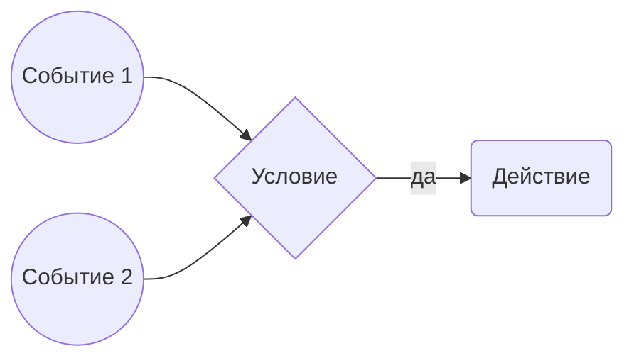

# Пользовательская документация

## Как это работает
- Пишем документацию в формате Markdown, вся документация представляет из себя корневую папку в котрой лежат текстовые файлы и файлы вложений. 
- C помощью серверной утилиты `honkit` генерим из этих текстовых файлов статичный сайт
- Сайт представляет из себя электронную книгу в которой есть:
    - Навигация (меню)
    - Поиск по ключевым словам
    - Управление отображением
        - Можно изменить шрифты
        - Можно изменить тему (Дневная / ночная / сепия)

В итоге получаем сборку методических материалов упакованных в полноценную книжку.

> Структурированный контент воспринимается лучше, чем тотже самый текст упакованный в вородовый документ лежащий на каком-то диске. 


## Кратко про маркадун

Markdown - это легкий язык разметки, который позволяет структурировать и форматировать текст с помощью простых символов и синтаксиса. Он был создан с целью облегчить написание и чтение текста, включая его преобразование в HTML-код.

Markdown предлагает простой и интуитивно понятный способ добавления форматирования к тексту без необходимости использования сложных HTML-тегов или других синтаксических конструкций. С помощью Markdown можно создавать заголовки, списки, цитаты, ссылки, изображения, таблицы и многое другое.

Преимущества использования Markdown включают простоту и читаемость кода, легкость освоения, переносимость между различными платформами и возможность преобразования Markdown в различные форматы, такие как HTML, PDF, DOCX и другие.

Markdown широко используется в различных областях, включая веб-разработку, документацию, блоги, форумы и системы контроля версий. Многие платформы и редакторы поддерживают Markdown как стандартный формат для создания и форматирования текста.

## Пример синтаксиса маркдаун

Ниже приведены примеры синтаксиса маркдаун разметки.

### Заголовки
```
# Заголовок  первого уровня
### Заголовок третьего уровня
#### Заголовок четвертого уровня
```
Как это выглядит: 

# Заголовок  первого уровня
### Заголовок третьего уровня
#### Заголовок четвертого уровня

### Списки:
```
- Элемент списка 1
- Элемент списка 2
- Элемент списка 3
```
- Элемент списка 1
- Элемент списка 2
- Элемент списка 3

### Выделения текста:

```
*Курсивный текст*
**Полужирный текст**
~~Зачеркнутый текст~~
```
Выглядит так:
*Курсивный текст*
**Полужирный текст**
~~Зачеркнутый текст~~

### Ссылки:

```
[Текст ссылки](https://www.example.com)
```
Выглядит так:
[Текст ссылки](https://www.example.com)

### Цытаты
```
> Это цитата. Цитаты могут быть использованы для выделения важной информации.
```
> Это цитата. Цитаты могут быть использованы для выделения важной информации.

### Картинки

```

```
Как это выглядит:


> Картинка может быть статичной, а может быть гифкой, гифки актуальны в случаях если надо показать интерфейс в котром в котором пользователю надо нажать некую последовательность кнопок. Лучше показать это с помощью гифки, чем грузить портянку из 3 скриншотов. 

### Графические схемы

``` 
flowchart LR
0((Событие 1 )) --> ?
1((Событие 2)) -->
?{Условие} --да--> 
2(Действие)
```



